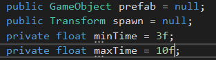

# Tutorial Jumper Oefening

Opdracht voor Vr Experience

2020 - 2021

<small>Witse Cools</small> &
<small>James Stoels</small>

---
## 1. Het Spelverloop

Het spelverloop wordt hieronder schematisch voorgesteld. De jumper moet over de obstacles springen die naar hem toekomen.

## 2. Observaties, acties en beloning
### 2.1 Observaties
De jumper moet kunnen zien welke obstacles er op hem af komen. Dus geven we hem 2 3D Rayperception components. Omdat de obastacles van 2 kanten zullen komen. Een 3D Rayperception component kan eigenlijk gezien worden als een oog, deze component kan geconfigureerd worden met een verschillende grootte van gezichtsveld, aantal stralen... 

### 2.2 Acties
Voor de jumper is er eigenlijk maar één actie, en dit is springen. Want de jumper moet enkel over de obstacles springen.

### 2.3 Beloning
Het belangrijkste voor de jumper is dat hij over de obstacles springt, hierdoor geven we de jumper een reward van __1__ als hij over een obstacle springt. Wanneer de jumper daarentegen een obstacle raakt verliest hij een reward van __1__. Ook verliest de jumper een reward van __1__ als hij het plafond raakt. Dit doen we omdat we niet willen dat de jumper extreem hoog springt. Tenslotte hebben we nog een negatieve reward van __0.01__, de jumper krijgt deze toegediend op elk moment waar die hoger is dan een y-waarde van 2. Deze laatste reward dienen we toe omdat we niet willen dat de jumper begint te zweven.

| Reward | Reason  |
| ------ | --------- |
| +1|Jumper springt over obstacle|
| -1|Jumper raakt obstacle|
| -1|Jumper raakt plafond|
| -0.01|Jumper zweeft boven bepaalde hoogte|
## 3. Het Speelveld
Hieronder is het speelveld zichtbaar met 2 wegen die elkaar kruisen en de jumper in het midden.

## 4. Spelomgeving

### 4.1 De Spawn
De spawn bevat de volgende objecten: Start, Map, Map (1), Start (1) en CubeSpawn. Start en Start (1) zijn de locaties waar de obstacles zullen spawnen. Map en Map (1) zijn de wegen die naar de jumper leiden, deze objecten bevatten ook beiden een spawner.cs script (*dit komt later aanbod*). Tenslotte heeft het spawn object nog een CubeSpawn object, dit is de locatie waar de jumper opnieuw zal spawnen.

### 4.2 De Jumper
De jumper is onze ml-agent en bevat de volgende componenten: behaviour parameters, jumper script, decision requester en een rayperception sensor 3D.

Ook bevat de jumper nog een object: Cube (1). Dit object heeft ook nog een rayperception sensor 3D.

### 4.3 Restrictions
De restrictions bevatten de volgende objecten: End, Cealing en End (1). End en End (1) zijn de eindpunten van de obstacles die doorlopen. Tenslotte de Cealing is de plaats waar de jumper eigenlijk niet over mag springen.

## 5 Scripts 
Om dit project te realiseren hebben de gameobjects moeten programmeren met behulp van C# Scripts. We leggen in dit onderdeel kort uit wat deze scripts doen.  

### 5.1 Obstacle
We moeten eerst een object hebben waar de jumper over moet springen. Dit object heeft ook een script nodig om op bepaalde manieren zich te gedragen. 
Deze klasse heeft 1 parameter __MoveSpeed__ dat er voor zorgt hoe snel of traag het object zich kan verder bewegen.

De klasse heeft twee methodes. De __Update()__ methode en de __OnCollisionEnter()__. De update methode laat het obstakel verder bewegen maar verwijderd het object ook automatisch na 20 seconde. Dit doen we uit veiligheid zodat er geen obstakels eeuwig in het speelveld blijven.

__OnCollissionEnter()__ zal er voor zorgen dat bij het aanraken van een muur het obstakel verwijderd wordt. Dit geldt ook voor als er twee obstakels elkaar raken ( in uitzonderlijke gevallen ).

### 5.2 Spawner
Dit script bestaat uit vier parameters hiebij kan je het __gameobject__ meegeven dat na een x aantal tijd opnieuw op het speelveld komt. De random gekozen tijd dat dit object opnieuw in het speelveld komt regelen we met een __minTime__ en __maxTime__. Zo kunnen we kiezen hoeveel tijd er minimum of maximum tussen mag zitten bij het object. Verder kiezen we ook nog een onzichtbaar object dat de __start__ aangeeft waar het object mag tevoorschijn komen.

Voor de spawner hebben we twee methodes, namelijk __Start()__ en __SpawnObstacle()__. De __Start()__ methode zorgt ervoor dat __SpawnObstacle()__ telkens wordt uitgevoerd.

Bij __spawnObstacle()__ geven we de random tijd mee en ook de positie naar waar het object moet gaan. 

### 5.3 Spawner2

Dit script is bijna het zelfde als het script van Spawner. Het enigste verschil is dat hier de richting moesten veranderen waar de objecten naar toe gaan. Dit konden we realiseren door een stukje code toe te voegen. 

### 5.4 Jumper

De Jumper klassen is de grootste. Hierbij zit de logica voor het Jumper gameobject. We geven de jumper met dit script wat intelligentie hoe hij op bepaalde manieren moet reageren. 

In deze klassen hebben we verschilende methodes:

- __Initialize()__ : Hierbij gaan we de agent altijd resetten dat hij terug bij de begin positie is. We initaliseren dan ook de Rigidbody van de spawn.

- __OnActionReceived()__ : Hierbij geven we de agent de mogelijkheid om te "springen" naar omhoog. We straffen de agent hier ook af indien hij boven een bepaalde waarde gaat. ( We doen dit zodanig dat hij niet in de lucht blijft).

- __OnEpisodeBegin()__ : Als een episode begint gaan we de agent resetten. Zo keert hij terug naar de begin positie.

- __Heuristic()__ : In deze methode zorgen we ervoor dat wanneer de upArrow key gebruikt wordt de agent naar omhoog kan gaan.

- __OnCollisionStay()__ : We gaan minpunten geven aan de agent indien hij een obstakel of de bovenmuur raakt. Als dit gebeurt gaat de waarde er af en wordt de episode beëindigd.

- __OnTriggerEnter()__ : We gaan de agent belonen als het over een obstakel kan springen. De collision van de agents raakt dan de collision die achter het obstakel staat. Hierdoor krijgt de agents plus punten. Als de agent 10 keer over een obstakel kan springen eindigt de episode.

- __UpForce()__ : Deze methode zorgt ervoor dat de agent effectief hoger kan gaan op de Y-as.

- __ResetMyAgent()__ : Hier zetten we de agent terug naar de begin positie.

Als we deze methodes aan elkaar wat koppelen en onze agent trainen krijgen we een goed resultaat. De jumper kan zelf over obstakels springen die langs twee kanten komen. 

## 6. Trainen NN
De configuratie van het brein van de jumper gebeurt in de jumper.yml file. Deze file bevindt zich in de Learning folder van ons project.
Deze learning folder is ook de plek waar we het brein van de jumper trainen.

## Demo
In de demo zien we het leerproces van de agent. We zien een positieve evolutie. Zo kan de agent al zelf de beslissing maken wanneer hij moet springen. 

